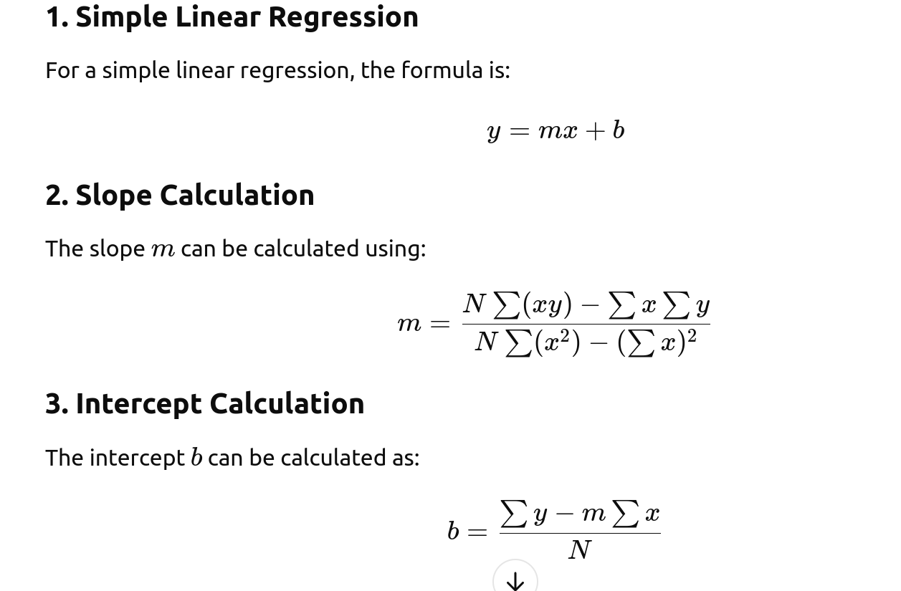
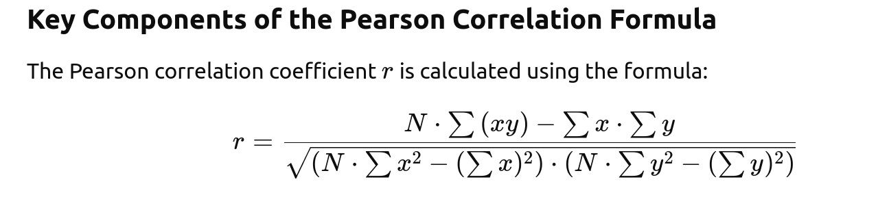

# Gues-it-2
## Overview

This program reads a list of float64s from a file and calculates the linear regression model as well as the Pearson correlation coefficient,avarage ,standard deviation, and variance. It then prints these statistical values to the console. Features:

    Reads float64 values from a file of type string.
    Calculates the linear regression model.
    Calculates the Pearson correlation coefficient,avarage ,standard deviation, and variance.
for linear-stats;




and then for pearson corellation


## Prerequisites

To run this program, make sure you have Go 1.16 or above installed on your system. You can download and install Go from golang.org. Clone this repository or download the source code from:
https://learn.zone01kisumu.ke/git/somulo/linear-stats.git.

## Usage

Ensure you have a file (e.g., data.txt) in the same directory as the program. This file should contain the population data whose statistics we are interested in.

Run the program with the default data.txt file:

```bash

go run . main.go data.txt
```
To run the program with a custom data file:

```bash

go run . main.go custom_data.txt
```
when  running the program and comparing it to the <b>stat-bin</b> file, consider doing the following:

1. unzip the ```gues-it-docarised``` file and copy it to the ```gues-it-2``` directory

2. inside the ```gues-it-docarised``` file, copy the```student``` directory. 

now you will run a and compare the results as follows:

i. run this command
```bash
    node server.js
 ```

or 

```npm install ``` ,     the run :
``` bash
    npm start

```

Input File Format

    The input file (e.g., data.txt) must contain a list of float64 numbers separated by newlines or spaces.
    Each line should only include valid numbers to avoid parsing errors.

## Code Structure

   * main.go: The main file containing the code logic.
   * avarage ,standard deviation, and variance give their respective outputs
    * linearreg.go: Calculates the linear regression of the population data.
   * pearsoncorr.go: Calculates the Pearson correlation coefficient.

## Error Handling

The program includes basic error handling for:

  * Invalid file names or paths.
  * Errors during file reading.
   * Unsupported characters not defined in the data file.
   *  Empty files.
    * If the file contains fewer than two valid float64 numbers, the program will return an error.

## Output Format

The program outputs the following results:

  * Slope and intercept of the linear regression line.
   * Pearson correlation coefficient between the data points.
   * avarage ,standard deviation, and variance

The values are printed in a formatted manner for easy interpretation. bit then you have to check the accurancy level against the number of data used.
Testing

The program includes unit tests for the core statistical functions. To run the tests, use:

```bash

go test ./...
```
Ensure all tests pass before deploying or running the program on actual datasets.
Dependencies

*  The program has no external dependencies apart from Go's standard library. However, ensure that the Go environment is properly set up with GOROOT and GOPATH configured if required.

## Limitations

* The program assumes that the input data follows a linear trend,pearson correlation ,avarage ,standard deviation, and variance. It may not be suitable for datasets with nonlinear relationships.
    The Pearson correlation coefficient is undefined if there is no variance in the data.

## Contributions
* Contributions are welcome! Please create an issue or pull request if you have suggestions or improvements.
## Maintainer

This project is maintained by <b>SAMUEL OKOTH OMULO</b>.